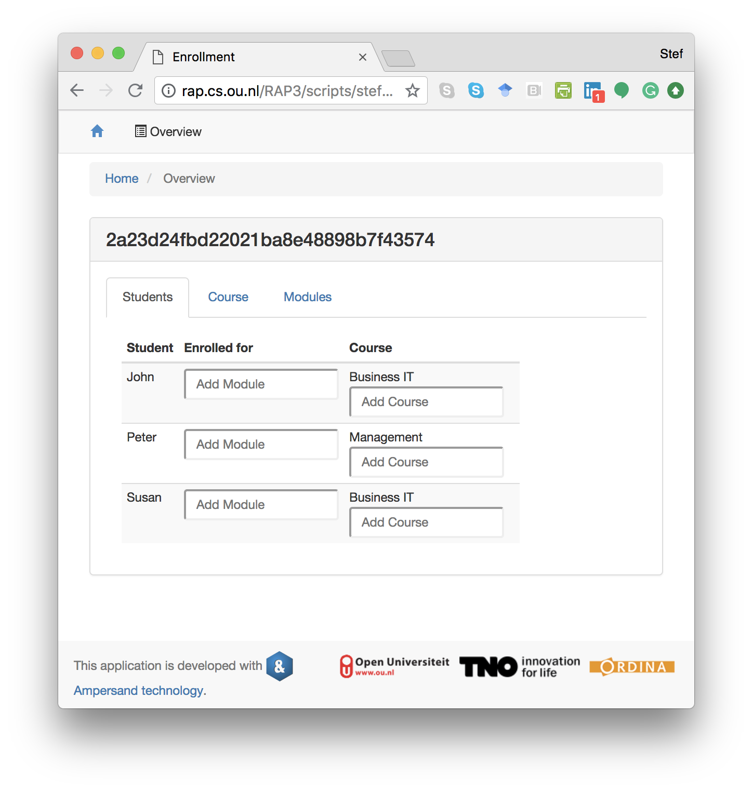

# Services

## Purpose

An service definition specifies how a user or a computer interacts with data from a [context](../context.md).

## Description

An interface specifies which data is presented to which users. For every different use of the system a different interface can be defined. This may lead to large numbers of interfaces for large and complex systems. However, one device will show one interface only at any given moment in time.

[This page](syntax-of-interface-statements.md) gives syntactic details of interfaces. Some more explanations [are found here](explanations.md).

## Example

```text
INTERFACE Overview : "_SESSION"                  cRud
TABS [ Students : V[SESSION*Student]             cRuD
        COLS    [ "Student"      : I[Student]    CRUD
                , "Enrolled for" : isEnrolledFor cRUD
                , "Course"       : takes         CRUD
                ]
     , Course : V[SESSION*Course]                cRuD
        COLS    [ "Course"  : I                  cRud
                , "Modules" : isPartOf~          CRUD
                ]
     , Modules : V[SESSION*Module]               cRud
        COLS    [ "Modules"  : I                 cRuD
                , "Course"   : isPartOf          cRud
                , "Students" : isEnrolledFor~    CRUD
                ]
     ]

```

This interface specifies three tabs. One shows students, one shows courses and one shows modules. This is what it looks like when run in a browser:



## Syntax and Meaning

Due to the complexity of interfaces, its syntax and meaning are discussed in [a separate section](syntax-of-interface-statements.md).

## Using an interface

On the user screen atoms are being displayed as data. If these atoms are displayed as hyperlink, Ampersand has recognized an interface for that atom to which the user can navigate.

When running an application in your browser, you are watching one user-interface at any given moment in time. Each hyperlink on your screen represents an atom to which some interface applies. To navigate to that user-interface, you click on the hyperlink. You will see the interface being applied solely to the atom you just clicked. To determine the atom\(s\) to which an interface applies, each interface has an _interface term_.

The next sections contain two examples: 

* a [client service](example-client.md) to allow clients of a web shop to change their name and address and show them status information of their orders;
* a [login service](example-login.md) to demonstrate how to get different interface structures under varying conditions.


