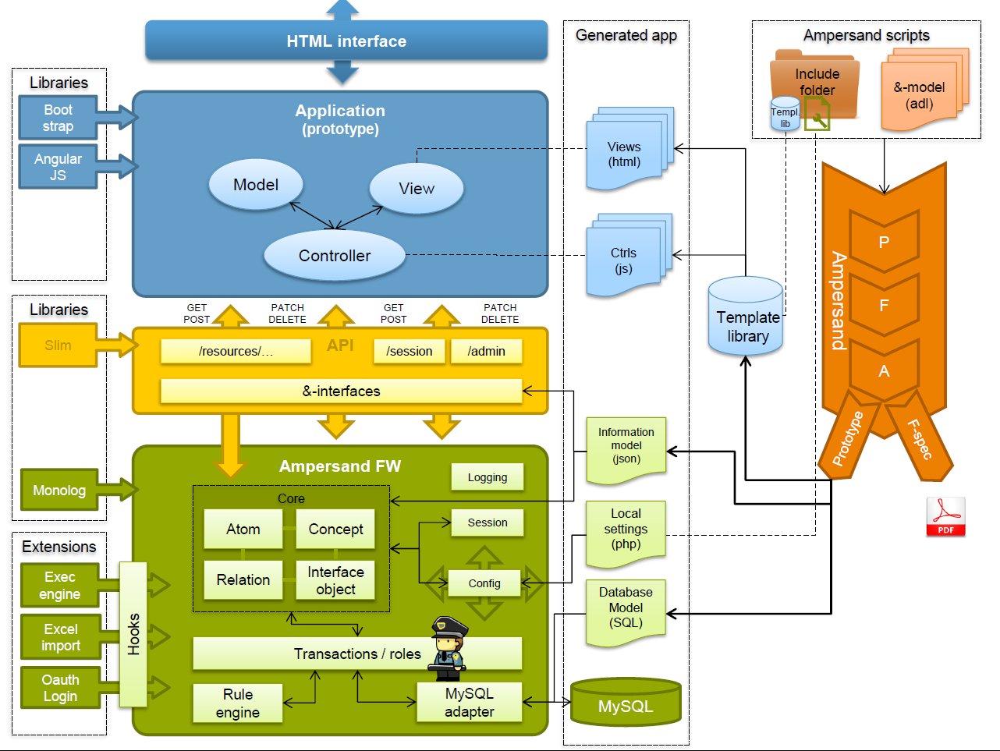

# Architecture of an Ampersand Application

This chapter is intended for programmers who wish to know more about the software Ampersand generates. There can be many reasons, such as wanting to change the user experience, add or change functionality in views and/or controls, or simply to use the API of an Ampersand application.

## Information systems

In general, any information system has a structure like the one depicted below:

An information system is meant to support users \(e.g. Peter, Sally, Daisy\). Differences among users can be handled by using roles \(e.g. customerRep, sysMgr, MgmtSupporter\). In this diagram, users are coloured to depict different roles. 

An information system consists of a number of services. We distinguish user facing services and non-user facing services. User facing services \(e.g. register a client, sanitize case files, login\) can be made available for a limited number of roles, giving each user access to precisely the services he or she is meant to see. In the diagram, user-facing services are colored corresponding to the roles they serve. Non-user facing services are not colored. Therefore, they are used exclusively by other software. Services can be either stateful or stateless. In the diagram, stateful services are drawn with a data container inside.

Services communicate by means of streams or by means of remote calls.

Currently, Ampersand generates correct information systems with one stateful service, which is the database. All other services are stateless and client-facing.

An Ampersand information system is deployed as a whole. Therefore it qualifies as a "monolithic" system.

## Software Architecture of an Ampersand application

Let us take a look at the software architecture of any system that Ampersand generates.

The architecture shows an Ampersand framework \(the green area\), which is a database application that serves as a stateful service. It ensures that all invariants are kept satisfied. It is the business engineer who defines those invariants, so she has the means to maintain business rules by encoding them in Ampersand. The Ampersand framework also ensures that changes to the database will keep all invariants satisfied. 

The framework is encapsulated by an application programming interface \(API, the yellow area\), which exports the functionality in a standardised way. Every application that interfaces through that API will therefore automatically preserve the integrity of data.

On top of the API, the application comes with a front-end application \(the blue area\). This web-application has a conventional structure, based on the well-known Model-View-Control \(MVC\) pattern used in many web-applications.

The unique feature of this application is that it is generated by the Ampersand compiler \(the orange thing on the right\). The compiler generates the application as a collection of HTML-pages \(views\) and JavaScript pages \(controls\), together with some code that is not generated \(static code\). The framework and the API are generic components that get their semantics from JSON files from the Ampersand compiler.

This architecture is reflected in the directory structure generated by Ampersand: 

