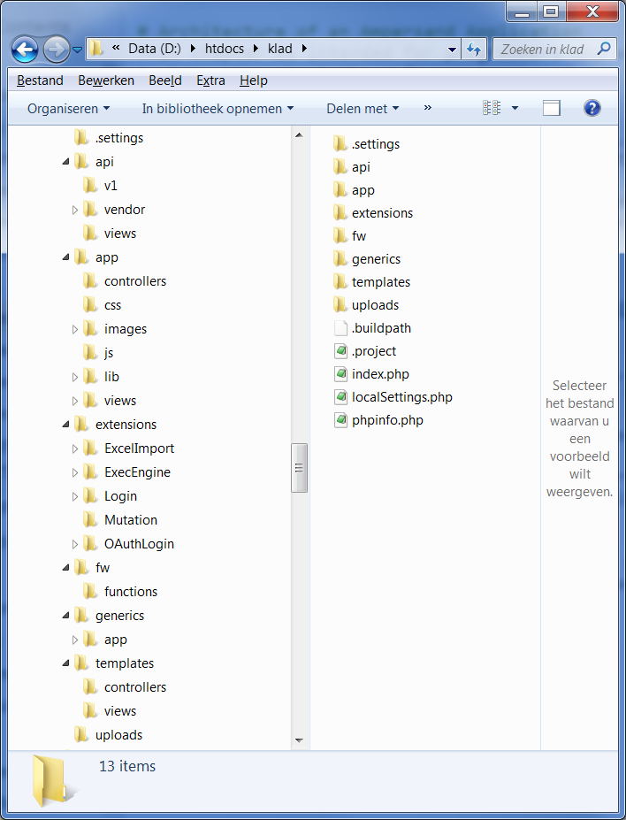

# Architecture of an Ampersand Application

This chapter is intended for programmers who wish to know more about the software Ampersand generates. There can be many reasons, such as wanting to change the user experience, add or change functionality in views and/or controls, or simply to use the API of an Ampersand application.

## Information systems

An information system typically has the structure as depicted here:

An information system is meant to support users \(e.g. Peter, Sally, Daisy\). Differences among users can be handled by using roles \(e.g. customerRep, sysMgr, MgmtSupporter\). In this diagram, users are coloured to depict different roles. 

An information system consists of a number of services. We distinguish user facing services and non-user facing services. User facing services \(e.g. register a client, sanitize case files, login\) can be made available for a limited number of roles, giving each user access to precisely the services he or she is meant to see. In the diagram, user-facing services are colored corresponding to the roles they serve. Non-user facing services are not colored. Therefore, they are used exclusively by other software. Services can be either stateful or stateless. In the diagram, stateful services are drawn with a data container inside.

Services communicate by means of streams or by means of remote calls.

Currently, Ampersand generates correct information systems with one stateful service, which is the database. All other services are stateless and client-facing.

An Ampersand information system is deployed as a whole. Therefore it qualifies as a "monolithic" system.

## Software Architecture of an Ampersand application

Let us look at the software architecture of a system that Ampersand generates.

The architecture shows an Ampersand framework \(the green area\), which is a database application that serves as a stateful service. It guarantees that each view can rest assured that all Ampersand invariants are satisfied. The Ampersand framework also guarantees that a view can only commit a change in the database if the database satisfies all invariants after committing that change. The Ampersand framework is encapsulated by an application programming interface \(API\), which exports the functionality in a standardized way. Every application that interfaces through that API preserves the integrity of data.

On top of the API, the application comes with a front-end application. This web-application has a conventional structure, based on the Model-View-Control \(MVC\) pattern used in many web-applications.

This architecture is reflected in the directory structure generated by Ampersand: 

