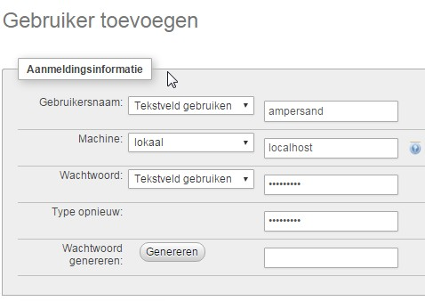

## Installation instructions

There are several ways to install an Ampersand compiler on your machine.

###  The easy way: Use a prebuilt executable file

The easiest way is by use of available executables. We update them frequently. Have a look at [our latest release](https://github.com/AmpersandTarski/Ampersand/releases).


### The less easy way: Installing from Source

If there is no executable for your operating system, or if you prefer to build one yourself, follow these steps:

> 1. Install stack, the haskell tool stack. [instructions are here](http://docs.haskellstack.org/en/stable/install_and_upgrade.html)
> 1. Then, have stack install everything you need to compile:
      ```$ stack setup```
> 1. use [git](https://git-scm.com/) to clone the latest version of Ampersand. The code can be found at [github](https://github.com/AmpersandTarski/Ampersand/tree/master). (the master branch is our stable branch)
> 1. Open a command line terminal, and go to the directory that contains the file named `ampersand.cabal`
> 1. Issue the following command:
    ````$ stack install```` 

This will build an Ampersand-compiler named "ampersand.exe" and install it into your path.


**Notes:**
  1. Do **not** use Hackage to get ampersand. It does not contain all non-haskell files. (See [issue #213](https://github.com/AmpersandTarski/ampersand/issues/213))

### 2) Other software you will need
* In order to generate PDF files that contain your functional specification, you need a LaTex compiler. We recomend **[MiKTeX](http://miktex.org/)**. Make sure to run [the update wizard](http://miktex.org/howto/update-miktex)! 
* All graphical output is created using **[GraphViz](http://www.graphviz.org/)**. You need to install it. **Make sure *dot* and *neato* are in your path**. Also, if you compile it from source, make sure you install it with gts support.
* In order to run the generated prototype, you need the following on the computer that you are using:
 * a working **SQL** database server. You must ensure that this server has an account for localhost, that has a user called `ampersand` with a password `ampersand`, with rights to create/read/update/delete databases as well as their contents.
 * a working (configured) web server that can run **PHP** (5.6 or higher). The webserver must run on `localhost` and listen on port 80, which is pretty default.
A practical way to arrange for this in Windows is to install **[XAMPP](https://www.apachefriends.org/download.html)**, and create the `ampersand` database account.
* For some libraries we use at runtime, you need to install **[Composer](https://getcomposer.org/download/)**. 
