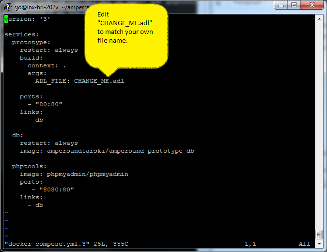

# Deploying your Prototype

## What do you need to understand?

To make your program run on virtually any computer we use Docker. Docker is a popular, automated platform on which your application runs. It works with recipes and configurations you provide. Docker loads the [_**images**_](https://docs.docker.com/get-started/#docker-concepts) it requires from [Docker Hub](https://hub.docker.com/u/ampersandtarski/) and cashes them in a local Docker repository to prevent reloading every time you compile a new version.

Programs run in [_**containers**_](https://docs.docker.com/get-started/#docker-concepts). A container is a virtual computer that runs an image. Your application may consist of one or more containers.

Please watch [this video](https://youtu.be/XqHTJfTVnoQ) \(8 minutes\) to see what Docker does to bring up your Ampersand program as a web application on your own machine.

## What do you need up front?

You need a computer that runs Docker and that has an internet connection. That lets you generate a Docker image from your Ampersand source code.

You need a computer that runs Docker to run your program on. That can be the same computer \(localhost\).

## What do you do to run your Ampersand program?

In your working directory make sure you have:

1. A file called `Dockerfile`, which contains the recipe for creating a Docker image
2. A file called `docker-compose.yml`, which contains the runtime configuration of the containers running your program.
3. The source code of your Ampersand program, as specified in `Dockerfile` and `docker-compose.yml.`

Then from you command line interface run:

`docker-compose up -d`

Sit back and watch. Don't worry, the second time around Docker downloads much less as it builds up its local image repository.

## Deploying

The deployment consists of the following steps:

1. Copy your `.adl`-file to a working directory on your server.  
2. Get two docker-files from internet by executing the following commands:

   ```text
    wget https://raw.githubusercontent.com/AmpersandTarski/Ampersand/feature/dockerize/docker/sample/Dockerfile
    wget https://raw.githubusercontent.com/AmpersandTarski/Ampersand/feature/dockerize/docker/sample/docker-compose.yml
   ```

   On servers other than Linux, you may need another command than `wget`, but the files are the same.

3. In the file called

   `docker-compose.yml`

   you must specify your own

   `.adl`

   -file:

   

4. Run docker-compose to deploy your prototype by executing the following command:

   ```text
    docker-compose up
   ```

   Alternatively, if you want your prototype to keep running after you have closed your CLI, execute:

   ```text
    docker-compose up -d
   ```

5. Browse to the web-location `my.server.com`, where the prototype is being served.

## Redeploying

After you deploy the first time, you may want to edit your program. Just save the results and redeploy with the command:

```text
docker-compose up -d --build
```

If you want to see which images are stored on your local computer, type

```text
docker images
```

## In trouble?

* Check if there is a firewall that blocks the port from internet. Make sure that port 80 is open for http-traffic.
* Check the port settings and adapt `docker-compose.yml` if you must use a port other than port 80.
* Use a recent browser. We have developed Ampersand on FireFox and tested it on FireFox and Chrome, so you should be fine with one of these two.
* If you have trouble with the database \(e.g. you cannot login, or do not have the correct authorization\), check out the [instructions](installing-the-tools-manually.md) for creating a properly authorized user `ampersand` for the database. As you can see in `docker-compose.yml`, the database itself is accessible through port 8080.

