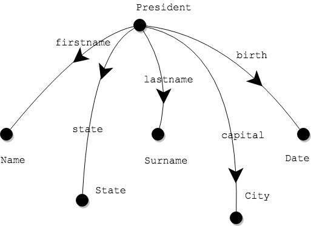
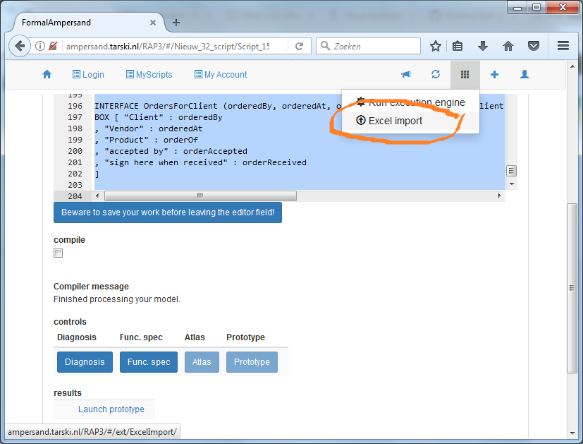
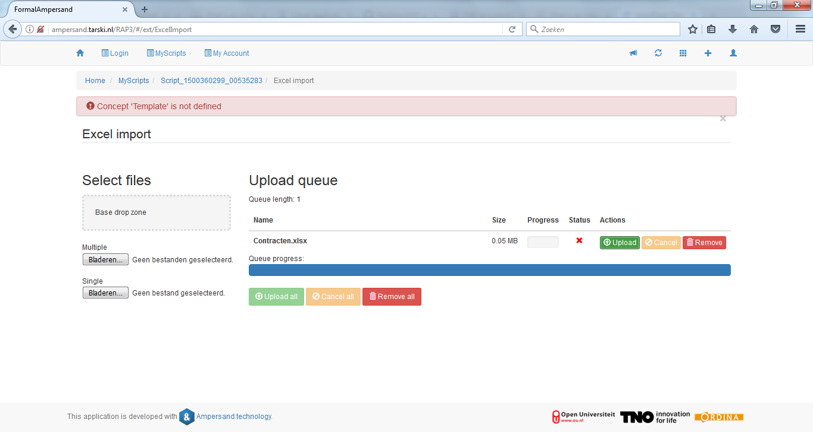

# Data modeling based on real-life data

When a data model serves to build an information system,
it must ensure that all data that is needed in practice can be represented in the database.
So you need a practical modeling technique based on actual data.
By using real-life samples of data, you can decide which data elements to include or leave out in the new model and be reasonably confident
that you don't leave any gaps.

In this section we will systematically extract concepts and relations based on data from a spreadsheet.
The result of this analysis is an Ampersand model, which you can use to generate a data model for you.

### Example

Let us start by looking at an example:

|  | firstname | lastname | birth |
| :--- | :--- | :--- | :--- |
| 1 | Abraham | Lincoln | February 12, 1809 |
| 2 | Barack | Obama | August 4, 1961 |
| 3 | Calvin | Coolidge | July 4, 1872 |
| 4 | Dwight | Eisenhower | October 14, 1890 |

Since Ampersand works with relations, it must represent this table as relations. Three relations can do the job in the following manner:

```text
POPULATION firstname[President*Name] CONTAINS
  [ ("1", "Abraham")
  , ("2", "Barack")
  , ("3", "Calvin")
  , ("4", "Dwight")
  ]

POPULATION lastname[President*Surname] CONTAINS
  [ ("1", "Lincoln")
  , ("2", "Obama")
  , ("3", "Coolidge")
  , ("4", "Eisenhower")
  ]

POPULATION birth[President*Date] CONTAINS
  [ ("1", "February 12, 1809")
  , ("2", "August 4, 1961")
  , ("3", "July 4, 1872")
  , ("4", "October 14, 1890")
  ]
```

## Modeling principle: extract relations from tables

In our example, each row in the spreadsheet represents a president. So, the source concept of each relation is `President`.
Each column represents a different relation. So we can use the name of each column as relation name.
Then, we invent names to describe the content of each column: `Name`, `Surname`, `Date`. 

When things get bigger, it is useful to draw the relations, so you keep overview. Here is how it is done:

This drawing shows every relation als a line, drawn from source to target. The arrowhead in the middle is only to remind the reader of which is the source and which is the target concept. If you point the arrowhead from source to target, you will always know how the relation is defined.

## Modeling principle: adapt as needed

Suppose we have a second table, which also has information

| \[State\] | capital | president |
| :--- | :--- | :--- |
| Vermont | Plymouth | Coolidge |
| Hawaï | Honolulu | Obama |
| Kentucky | Frankfort | Lincoln |
| New York | New York | Roosevelt |
| Georgia | Atlanta | Carter |

This table is similar with respect to the interpretation of a row: here too, each row represents a president.
However, the presidents aren't numbered in this table, so we have to add these numbers.

| | \[State\] | capital | president |
| :--- | :--- | :--- | :--- |
| 3 | Vermont | Plymouth | Coolidge |
| 2 | Hawaii | Honolulu | Obama |
| 1 | Kentucky | Frankfort | Lincoln |
| 5 | New York | New York | Roosevelt |
| 6 | Georgia | Atlanta | Carter |

Numbering rows has the advantage that it is easier to recognise a president. 

```text
POPULATION state[President*State] CONTAINS
  [ ("1", "Kentucky")
  , ("2", "Hawaii")
  , ("3", "Vermont")
  , ("5", "New York")
  , ("6", "Georgia")
  ]

POPULATION lastname[President*Surname] CONTAINS
  [ ("1", "Lincoln")
  , ("2", "Obama")
  , ("3", "Coolidge")
  , ("4", "Eisenhower")
  , ("5", "Roosevelt")
  , ("6", "Carter")
  ]

POPULATION capital[President*City] CONTAINS
  [ ("1", "Frankfort")
  , ("2", "Honolulu")
  , ("3", "Plymouth")
  , ("5", "New York")
  , ("6", "Atlanta")
  ]
```

Notice that this deviates slightly from the previous recipe.
Instead of making a new relation `president[President*President]`, we have reused the relation `lastname`.
By doing so, we have interpreted the third column of the spreadsheet as the last name of the president.
More importantly, we have reused an earlier relation.
The drawing can also be extended:


There seems to be something funny about the relation `capital`.
In the model this relation pairs presidents to capital cities of the state in which they were born.
This meaning can be made more obvious, by redefining relations somewhat:

```text
POPULATION capital[State*City] CONTAINS
  [ ("Kentucky", "Frankfort")
  , ("Hawaii", "Honolulu")
  , ("Vermont", "Plymouth")
  , ("New York", "New York")
  , ("Georgia", "Atlanta")
  ]
```


## Reusing existing data

In practical applications, you might want to reuse data from existing spreadsheets.
People tend to have lots of "informal administration" in spreadsheets, which gives you access to authentic population. Surely you need that data organized in rows, but fortunately that is reasonably common. In such cases, you just add two lines above each table to inform Ampersand about the relations that are populated. In other cases, you have some work organizing the spreadsheet for importing it.

## Uploading your spreadsheet

You will find the Excel import function in the menu bar on the top right of your screen




This is what your upload screen looks like: 



 You can upload one or more .xlsx-files by dropping them in the drop zone or by selecting them. You have to upload the population with the green 

_Upload_

 button. At that time, all population from the .xlsx-file is added to the context and checked for inconsistencies. As a result, you may get errors when uploading. Only error-free spreadsheets will be uploaded successfully. As long as an error remains, the population in your context will not change.

## Assignment

Make a population of your own for the Hawaii-script and put it in a .xlsx spreadsheet. As described above. Make sure to delete the population statements from your Hawaii source code, to make sure that you get to see the population from your .xlsx-file. Generate a prototype from your Hawaii-application, upload your population in Excel and play around with the results.

## What have you learned?

After finishing your assignment, you have learned:

* to upload population to your Ampersand application in the form of a spreadsheet in .xlsx-format;
* to understand how a `POPULATION`-statement relates to the contents of a spreadsheet;
* that the contents of the spreadsheet is added to the population of your context, provided this does not lead to any conflict.

