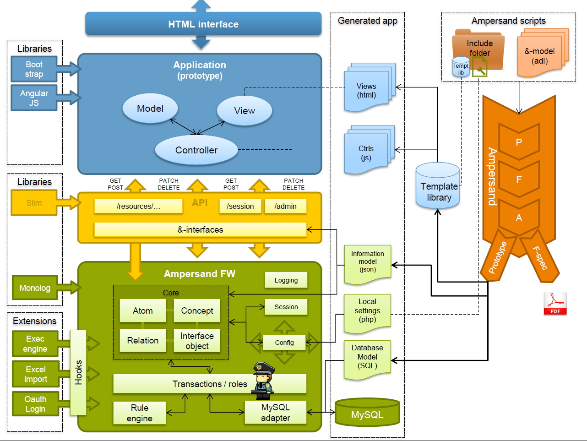
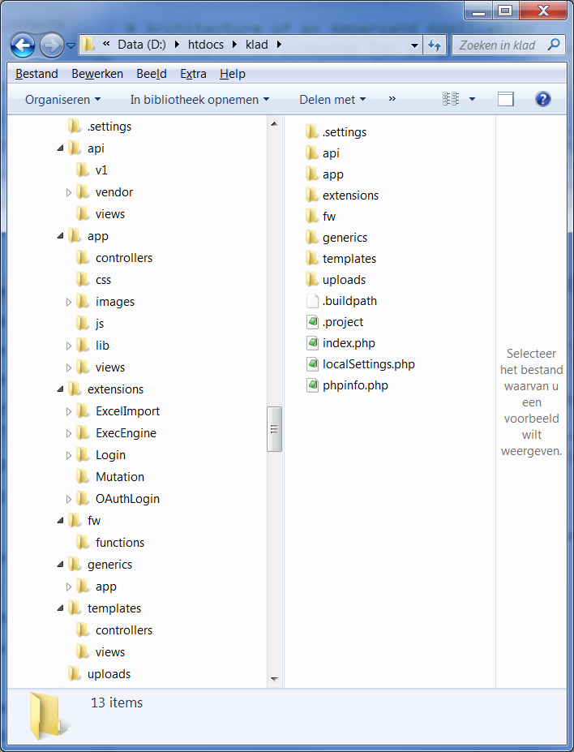

# Architecture of an Ampersand Application

This chapter is intended for programmers who wish to know more about the software Ampersand generates. There can be many reasons, such as wanting to change the user experience, add or change functionality in views and/or controls, or simply to use the API of an Ampersand application.

Momentarily, this chapter is under construction, so you may find too little information for the purposes mentioned above. Please bear with us and contact the authors for help.

The architecture shows an Ampersand framework, which is a database application with services on top. It is encapsulated by an application programming interface \(API\), which exports the functionality in a standardized way. Every application using the application should interface with that API in order to preserve the integrity of data.

On top of the API, the application comes with a front-end application. This web-application has a conventional structure, based on the Model-View-Control \(MVC\) pattern used in many web-applications.

This architecture is reflected in the directory structure generated by Ampersand: 

