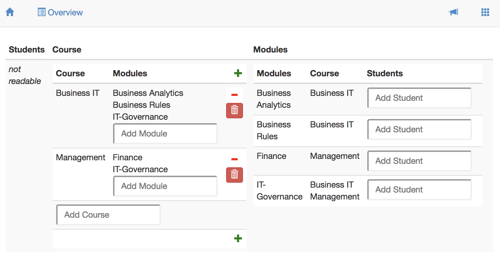
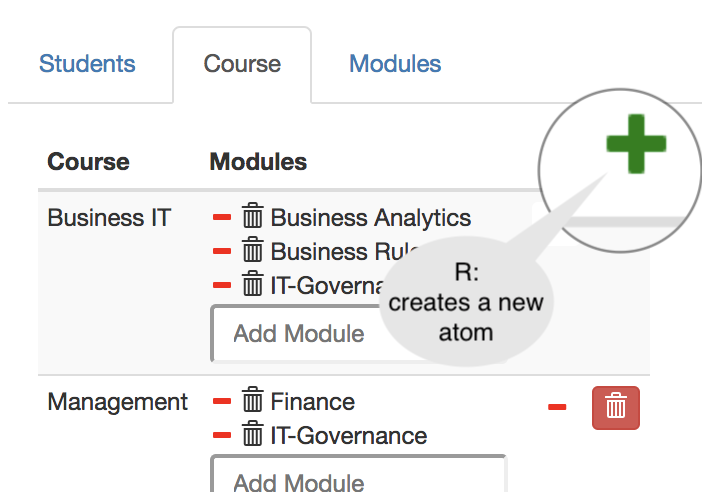
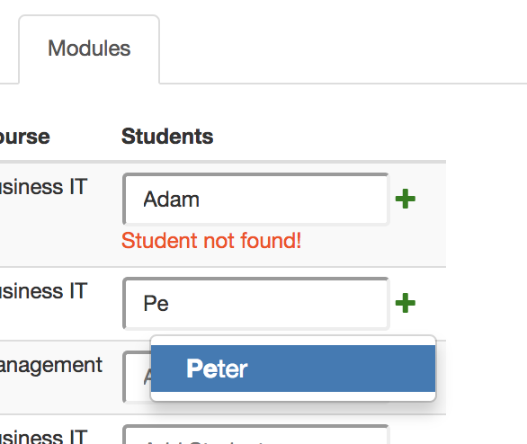

# CRUD

CRUD annotations are used in services to constrain the functionality of fields and boxes in an `INTERFACE`-statement. This allows you to minimize the functionality for your users, to design for easy learning.

Each CRUD annotation comes right after a [term](../terms/), so we can always refer to "the term" to which a CRUD annotation belongs. A CRUD annotation constrains the things your user can do with the target atoms and the pairs of its term.

The CRUD-annotation specifies Create, Read, Update, and Delete rights for the term it follows. Capital = allowed, Non-capital = not allowed. CRUD is the default, so if you specify nothing, everything is allowed. The following service definition illustrates this.

```text
INTERFACE Overview : "_SESSION"                  cRud
COLS [ Students : V[SESSION*Student]             crud
        COLS    [ "Student" : I[Student]         CRUD
                , "Enrolled for" : isEnrolledFor cRUD
                , "Course" : takes               CRUD
                ]
     , Course : V[SESSION*Course]                CRUD   -- used for a box
        COLS    [ "Course" : I                   cRud   -- used for a field
                , "Modules" : isPartOf~                 -- CRUD is default
                ]
     , Modules : V[SESSION*Module]               cRud
        COLS    [ "Modules" : I                  cRuD
                , "Course" : isPartOf            cRud
                , "Students" : isEnrolledFor~    CRUD
                ]
     ]
```

The user interface defined by this service is shown as a screenshot below. Notice that the lowercase r in the annotation of the Students box prevents showing the underlying box. The full CRUD functionality in Course yields 'create' functionality \(the green plus-button\), 'remove pair' functionality \(red minus button\), and 'delete atom' functionality \(the red trash can button\). The lowercase c, u, and d in the Modules box prevents displaying that functionality in the user interface.



The next sections give some more detailed information on the run time semantics for CRUD annotations as implemented in Ampersand.

## Create

| CRUD | for a box | for a field. |
| :--- | :--- | :--- |
| C |   A + \(plus\) button is displayed that lets you create a new atom, but only if the box-expression is editable. |  Enter a new atom and a `+` button appears. Click the + to add that atom to the listed set of atoms. If you enter an atom that exists \(Peter\), you can select it. |
| c | Atoms cannot be created | Atoms cannot be created |

## Read

| Read | CRUD for boxes |  | CRUD for fields |
| :--- | :--- | :--- | :--- |
| R | Read is allowed |  | Read is allowed |
| r | Read is not allowed |  | Read is not allowed |

## Update

| Update | CRUD for boxes | CRUD for fields |
| :--- | :--- | :--- |
| U |  Removing and/or adding a pair \(src,tgt\) is allowed if expr is editable and the atom exists. Deleting a pair is done with the - button; the atom will NOT be deleted. |  Removing and/or adding a pair \(src,tgt\) is allowed if expr is editable and the atom exists. Deleting a pair is done with the - button; the atom will NOT be deleted. |
| u | Update is not allowed | Update is not allowed |

## Delete

| Delete | CRUD for boxes |  | CRUD for fields |
| :--- | :--- | :--- | :--- |
| D | Not possible |  | Delete atom \(tgt\) and all pairs in which it is used. |
| D | Not possible |  | Delete atom \(tgt\) and all pairs in which it is used. |

A top-level Update or Create are common in my own scripts, e.g. to create an overview of People and be able to create a new Person: `INTERFACE "People" : V[SESSION*Person] CRud COLS []`. And update is also possible.

Keep in mind that the crud rights are about the relation\(expression\) and not the root atom. In \#141 we described the semantics of the CRUD syntax. In short:

| CRUD | Tgt concept ISA Object | Tgt concept ISA Scalar |
| :--- | :--- | :--- |
| C | Be able to add a new link by creating a new atom \(concept = tgt of expr\). If expr is not a relation, the atom is created, but not the link. Depending on the expression, the newly created atom might appear or not. | NA Warning: Not possible, use update |
| c | Not allowed to create new tgt atom | NA |
| R | Read allowed | Read allowed |
| r | Read not allowed | Read not allowed |
| U | Add and/or remove link from src atom to existing atoms \(concept = tgt of expr\). When expr is not a relation -&gt; Warning: Update not possible | Add and/or remove link from src atom to tgt atom. Tgt atom does not have to exists \(because it is a scalar\). When expr is not a relation -&gt; Warning: Update not possible |
| u | Add/remove links not allowed | Add/remove links not allowed |
| D | Remove link by deleting tgt atom. All other links from/to tgt atom are also removed | NA Warning: Not possible, use update |
| d | Remove link by deleting tgt atom not allowed | NA |

Motivations for CRUD-functionality are found in the [GitHub discussions on CRUD](https://github.com/AmpersandTarski/Ampersand/issues?utf8=✓&q=is%3Aissue+label%3Acrud+) functionality.

