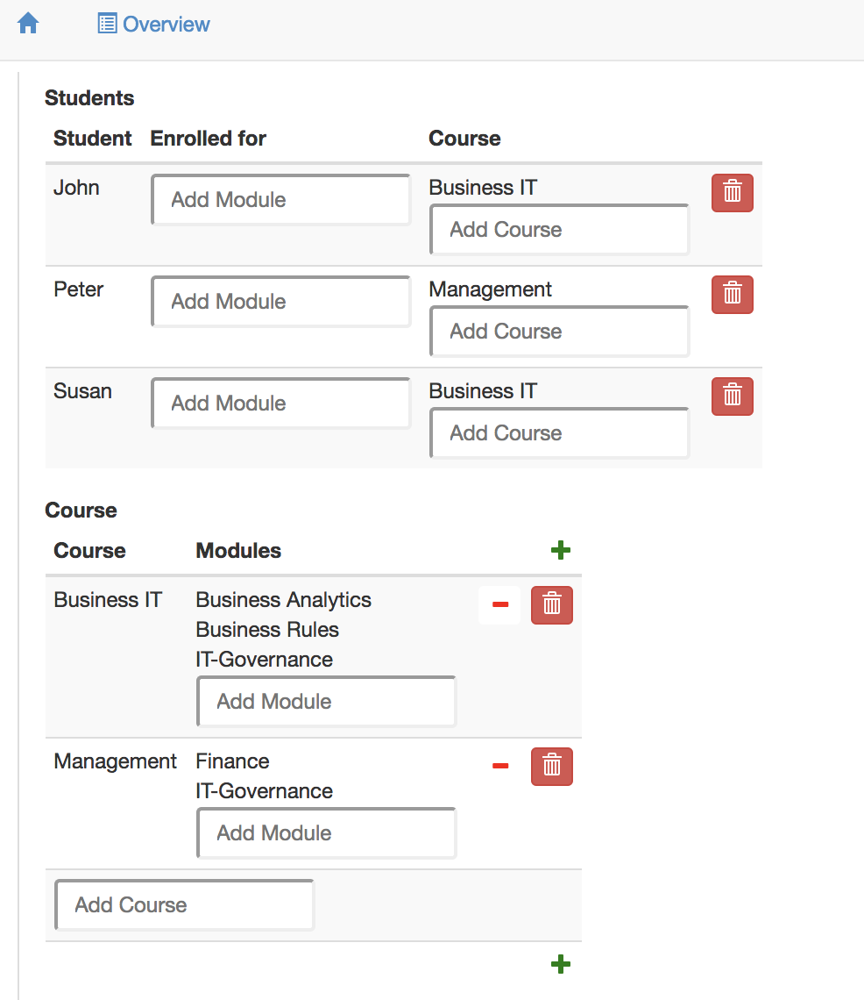
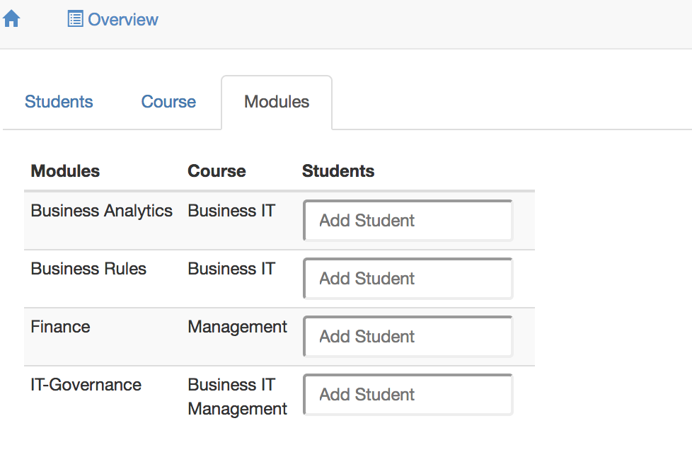

# Layout of user interfaces

Ampersand is meant for back-end design. Front-end design has been kept out of Ampersand, because that is covered much better in contemporary web-based design tools. However, we do want to build prototypes with roughly a good design. For this purpose Ampersand offers some features that let you get acceptable results in no time.

Ampersand has three built-in layout options, [colums](./#column-layout), [rows](./#row-layout) and [tabs](./#tabular-layout), which you can mix freely.

## Column layout

The column layout uses the keyword `COLS` to instruct the front-end application to use a columnar layout in user interfaces. Here is an example of a service, which uses the column layout.

```text
INTERFACE Overview : "_SESSION"                  cRud
COLS [ Students : V[SESSION*Student]             crud
        COLS    [ "Student" : I[Student]         CRUD
                , "Enrolled for" : isEnrolledFor cRUD
                , "Course" : takes CRUD
                ]
     , Course : V[SESSION*Course]                CRUD
        COLS    [ "Course" : I                   cRud
                , "Modules" : isPartOf~          CRUD
                ]
     , Modules : V[SESSION*Module]               cRud
        COLS    [ "Modules" : I                  cRuD
                , "Course" : isPartOf            cRud
                , "Students" : isEnrolledFor~    CRUD
                ]
     ]
```

This service shows three columns in the user interface, **Students**, **Course** and **Modules**. The first column is not readable, because the [CRUD annotation](../crud.md) blocks this column for reading. It would have shown students in each row, because the target of `V[SESSION*Student]`is `Student`. The second column shows courses in two columns, **Course** and **Modules**. The third column shows modules in three columns. This is what the user will see on the screen. 


## ROW layout

The row layout uses the keyword `ROWS` to instruct the front-end application to layout the user interface row by row. Here is an example of a service, which uses the row layout on the top level.

```text
INTERFACE Overview : "_SESSION"                  cRud
ROWS [ Students : V[SESSION*Student]             cRuD
        COLS    [ "Student" : I[Student]         CRUD
                , "Enrolled for" : isEnrolledFor cRUD
                , "Course" : takes CRUD
                ]
     , Course : V[SESSION*Course]                CRUD
        COLS    [ "Course" : I                   cRud
                , "Modules" : isPartOf~          CRUD
                ]
     ]
```

This service shows three rows in the user interface, **Students**, **Course** and **Modules**. The first column shows students in each of its rows. Each student is shown in the column layout. The second row shows courses in two columns, **Course** and **Modules**. Please read the [explanation of CRUD annotations](../crud.md) if you are curious about that. This is what the user will see on the screen. 



## Tabular layout

The column layout uses the keyword `TABS` to instruct the front-end application to tabs in the user interface. Here is an example of a service, which uses the column layout.

```text
INTERFACE Overview : "_SESSION"                  cRud
TABS [ Students : V[SESSION*Student]             cRuD
        COLS    [ "Student" : I[Student]         CRUD
                , "Enrolled for" : isEnrolledFor cRUD
                , "Course" : takes CRUD
                ]
     , Course : V[SESSION*Course]                CRUD
        COLS    [ "Course" : I                   cRud
                , "Modules" : isPartOf~          CRUD
                ]
     , Modules : V[SESSION*Module]               cRud
        COLS    [ "Modules" : I                  cRuD
                , "Course" : isPartOf            cRud
                , "Students" : isEnrolledFor~    CRUD
                ]
     ]
```

This service shows three tabs in the user interface, **Students**, **Course** and **Modules**. Only one tab is shown at a time, to avoid cluttered data. This is what the user will see on the screen.



We have discussed the `COLS`, `ROWS`, and `TABS` layout options. Please note that these options do not change the semantics; whatever your options, Ampersand displays the same data in the same fields.

If these options are not enough, you can [enhance your application with your own layouts](your-own-widgets-html-and-css.md).

