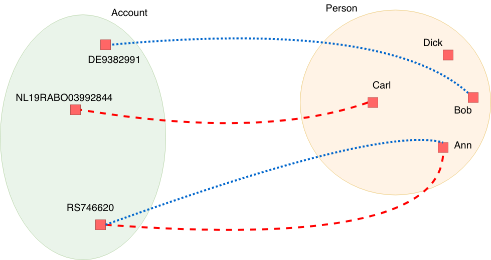

# Semantics of boolean operators visualized

Consider two relations: `authorized[Account*Person]` and `beneficiary[Account*Person]`. The first relation tells which persons are authorized to which accounts. The diagram shows this as red dashed lines. The second relation tells which persons stand to benefit from which accounts.. It is depicted by dotted blue lines in the diagram.

This diagram gives an example population of the relations `authorized[Account*Person]` and `beneficiary[Account*Person]`. Bob is authorized for account DE9382991 and Ann is authorized for account RS746620. Carl stands to benefit from account NL19RABO03992844 and Ann stands to benefit from account RS746620. Formally, we say:

| statements |
| :--- |
| `"NL19RABO03992844" beneficiary "Carl"` |
| `"DE9382991" authorized "Bob"` |
| `"RS746620" authorized "Ann"` |
| `"RS746620" beneficiary "Ann"` |

By combining the relations `authorized` and `beneficiary`, we can derive the following true statements.

| statement |  natural language |
| :--- | :--- |
| `"RS746620" (authorized/\beneficiary) "Ann"` | Ann is authorized for and stands to benefit from for account RS746620. |
| `"NL19RABO03992844" (authorized\/beneficiary) "Carl"` | Carl is authorized for or stands to benefit from account NL19RABO03992844. |
| `"RS746620" (authorized\/beneficiary) "Ann"` | Ann is authorized for or stands to benefit from account RS746620. |
| `"DE9382991" (authorized\/beneficiary) "Bob"` | Bob is authorized for or stands to benefit from account DE9382991. |

