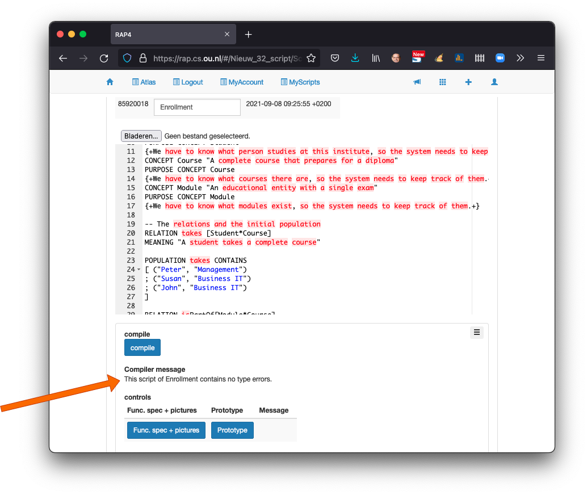

# Making your first Ampersand script

## Open your editor, copy a correct script into it, and enjoy...

When you click on the blue plus-sign on the top-right side in the menu bar in your screen, you can make a new script. Clicking this opens an editor screen in which you can type your very first Ampersand script.

## Assignment

* Copy the code for the system enrollment from [this page](example-system-enrollment.md) or take it from the OU course-site. The code starts with `CONTEXT` and ends with `ENDCONTEXT`. Paste the script in the RAP4 editor \(On rap.cs.ou.nl only:  you now have to click on the big blue button "beware to save your work before leaving the editer field!"\). The script is now saved in RAP4.
* Next, click on the blue Compile button. When RAP4 is finished compiling your script, the compiler message should read "The script of Enrollment contains no type errors" and two blue buttons should be visible below that. Please make it a habit to read the Compiler message carefully each time you compile a script

* Browse through the elements of your script in the Atlas \(in the menu bar\).
* Generate a Prototype: Click the blue button "Prototype" and when RAP4 has finished loading you will see a new link "Launch Prototype".
  * Click the link to run your prototype. It will in a new tab in your browser.
  * Now you see the information system you have just compiled from the code. You are already familiar with the look and feel. Click the Overview button in the top-left of the screen and have a look around.
* Try to generate a functional specification: Click on the button Func. spec. When RAP4 is done, a link will be added below the button.
  * Click the link to download the file. This is a .docx-file suitable for MS-word.

During the remainder of this course you will compile and run your own scripts in this way, so it pays to familiarize yourself with it.

You are now going to change some code and view the results in RAP4. Navigate back to your script editor \(wherever you are, you can always go back to it via "MyScripts" in the menu bar\).

* If you want to save the original script, go to MyScripts, create a new script and copy the same code in there.
* Let's add the possibility to register teachers in this system:
  * Define a new concept with the keyword CONCEPT: `CONCEPT Teacher`with a short description. Note that concept names start with an Uppercase and that all quotes need to be double quotes.
  * Define the relation between Module and Teacher with the keyword RELATION: `RELATION providedBy[Module*Teacher]` `MEANING "A module is provided by a teacher"` Note that relation names start with lowercase.
  * You can define an initial set of teachers and relate them to a module following the examples already available in the script. But you can also add the data later using the prototype. \(Adding initial data in the script is a lot of work. There is another method, using spreadsheets. This is another topic in this tutorial.\)
  * Add a service for the teachers in the third tab, the one for Modules. Below the codelines for "Modules" and above the line for "Course": `, "Teacher" : providedBy CRUD`
  * Save, compile, create protype, launch prototype, reinstall database and see the result in the third tab called "Modules". Note that you need to reinstall the database because the old database is still there, but the database structure has changed in the application.
  * Note that we have not defined any rules about teachers, so anything you fill in, is OK for this system.
* Try to understand what you see in the script by making other changes, compile and inspect the changes; learn by doing. Try for instance to create a new course with modules and teachers. Demonstrate your changes to your peers and discuss the results.

## What have you learned?

After finishing your assignment, you have learned:

* how to use RAP4 to write, save and compile code.
* the first basic keywords of Ampersand script and their effect on the prototype.

## Want to learn more?

1. How to describe functionality in a [conceptual model](conceptual-model-enrollment.md)?
2. How can I upload [bulk data](https://github.com/ampersandtarski/documentation/tree/662a3e7bdf67bf950cfc029e4c51efc919c0bf53/tutorial/data-in-spreadsheets.md) from spreadsheets into my application?

