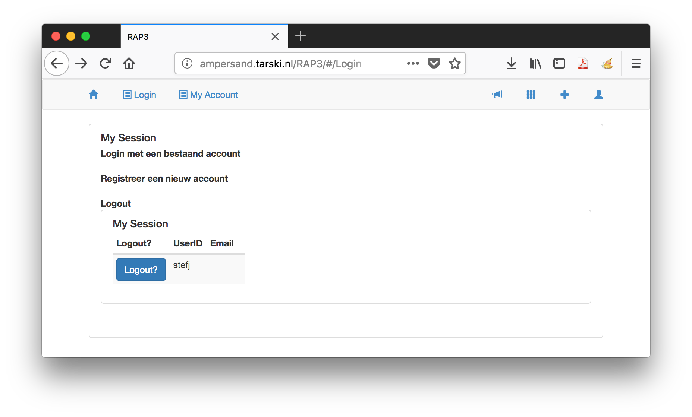

# Your tool: RAP3

This section introduces the tool you will use during the course: RAP3. This tool stores Ampersand-scripts in which you can specify, analyze and build information systems. It runs in the cloud, so all you need is a browser and to [click here](http://rap.cs.ou.nl/RAP3) to start using it.

## Login/Create account

RAP3 keeps your work together under a student number. So click on the button 'login' on the left top of the screen.

Register with your own student number and e-mail. Create a password. Your student number is your account, but you can fill in a name. This name should not exist yet, so a green plus-sign will appear. Click on it and your name is added to the database.

Notes:

* About the user interface: Each time you change fields \(e.g. using Tab\), the form is updated. But you will not see what is the next active field. You may have to click again to ensure that your cursor is in the right field.
* This application has no connection with the OU database, so be careful to fill in the right number on this and future occasions.

  This login-screen is also the screen to logout later.

* When RAP3 is updated, probably your account will be reset. You need to register again. We will inform you in the unlikely event that this happens during a course.

## Use the system

After logging in, you will see your login name or student number in the RAP3 window.

In the menu bar you will find:

* A horn symbol. Just ignore that for now, because it contains debug settings.
* a 3x3 grid, which contains some Ampersand extensions.
* a plus \(+\) symbol. That is important, because it lets you create a new Ampersand script.
* a person-like symbol. It lets you switch on/off some role dependent functionalities. If you have more than one role, just try it out and watch functionalities appear and disappear from the menu bar.

Notes:

* After a period of not using RAP3, you will be logged out automatically. In the current system, you may get errors or weird behaviour. Please navigate back to the login screen to check whether you are still logged in.

## Want to learn more?

* how can I [make and run my first Ampersand script](making-your-first-ampersand-script.md).
* How can I describe functionality in a [conceptual model](conceptual-model-enrollment.md)?
* How can I upload [bulk data](https://github.com/ampersandtarski/documentation/tree/662a3e7bdf67bf950cfc029e4c51efc919c0bf53/tutorial/data-in-spreadsheets.md) from spreadsheets into my application?

## What have you learned?

* where to find the Repository for Ampersand Projects \(RAP3\)
* to register yourself in RAP3

## Disclaimer

RAP3 is under development. You can expect to find teething problems \(kinderziektes\) in the software. Please notify us by [making an issue in our issue registration system](https://github.com/AmpersandTarski/RAP/issues). This way you can help improve Ampersand's tooling, for which the Ampersand-team is very grateful.

